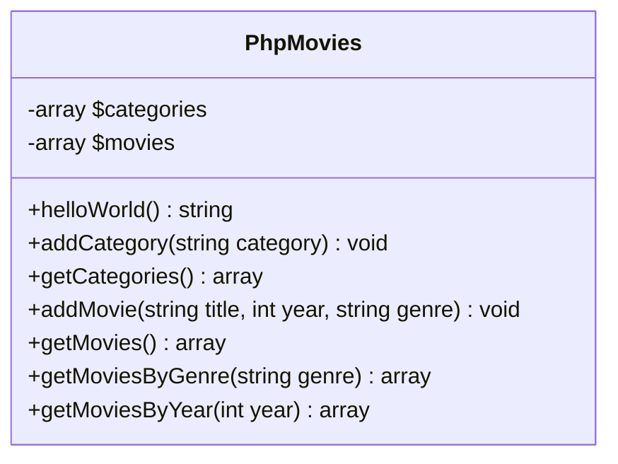
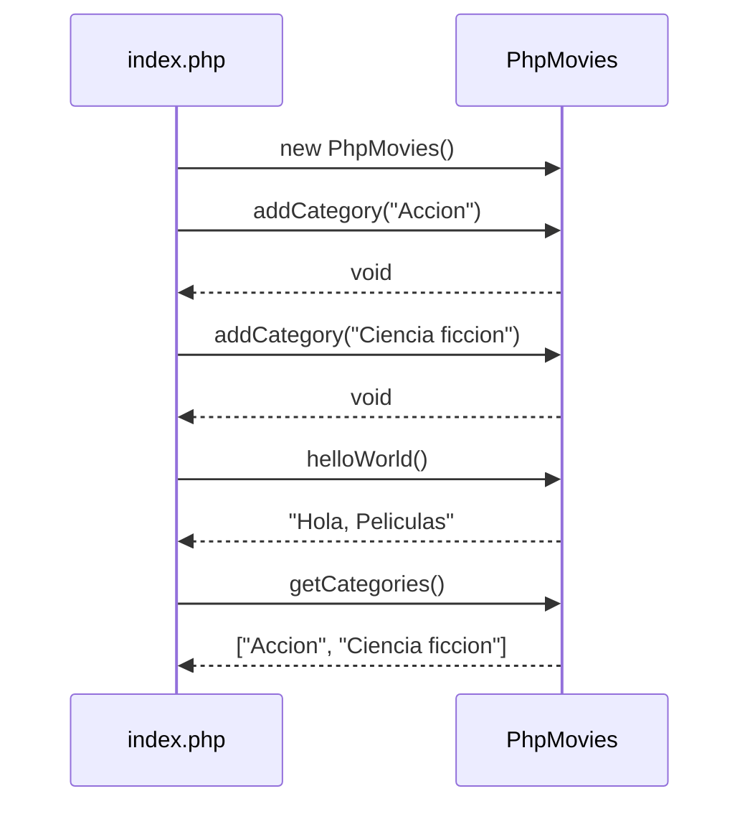

## Php Movies

Proyecto PHP de ejemplo para gestionar peliculas.

### Funcionalidad actual

- La clase `PhpMovies` incluye el metodo `helloWorld()`.
- Permite registrar categorias con `addCategory(string $category)`.
- Permite listar las categorias registradas con `getCategories()`.
- Permite agregar peliculas con `addMovie(string $title, int $year, string $genre)`.
- Permite listar peliculas con `getMovies()`.
- Permite filtrar peliculas por genero con `getMoviesByGenre(string $genre)`.
- Permite filtrar peliculas por año con `getMoviesByYear(int $year)`.

### Ejemplo

```php
$phpMovies = new PhpMovies();
$phpMovies->addCategory('Accion');
$phpMovies->addCategory('Ciencia ficcion');

print_r($phpMovies->getCategories());
```

### Diagrama de clases



### Diagrama de secuencia


